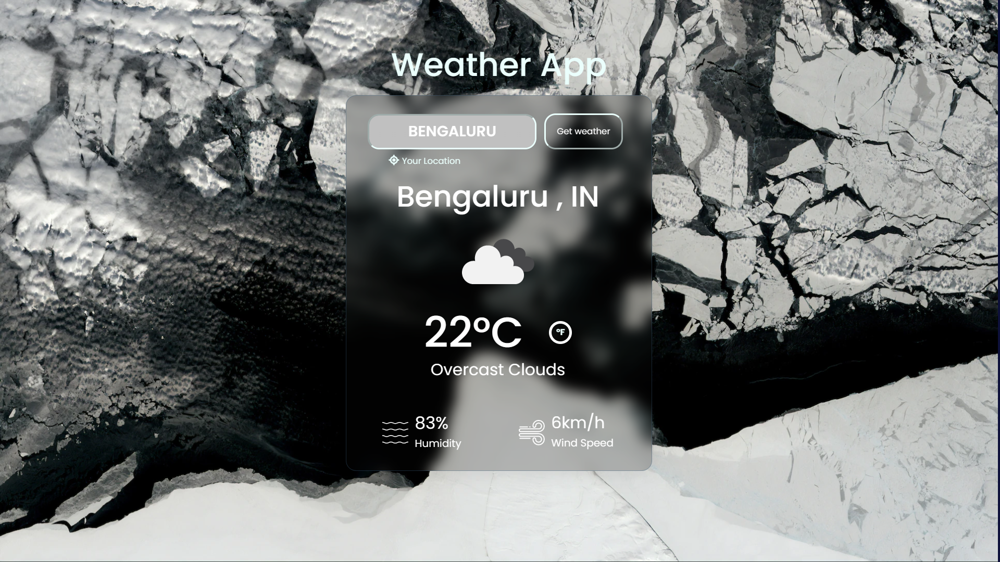

# Weather App

A simple web Weather App using HTML, CSS and Javascript that allows you to check the weather forecast for any city around the world.

## Features

- **Search by City**: Enter the name of a city, and the app will provide you with the current weather conditions for that location.
- **Toggle Temperature Units**: Easily switch between Celsius and Fahrenheit by clicking the toggle button.
- **Geolocation**: Get the weather for your current location with the "Your Location" button.
- **Responsive Design**: The app is designed to work seamlessly on both desktop and mobile devices.

## Demo

You can try the app live at [Weather App Demo](https://your-demo-link.com).

## Installation

To run this app locally, follow these steps:

1. Clone this repository: `git clone https://github.com/yourusername/weather-app.git`
2. Navigate to the project directory: `cd weather-app`
3. Open `index.html` in your web browser.

## API Key

This app uses the OpenWeatherMap API to fetch weather data. To make it work, you'll need to obtain an API key from [OpenWeatherMap](https://openweathermap.org/api) and replace the placeholder `apiKey` in `index.js` with your API key.

## Technologies Used

- HTML5
- CSS3
- JavaScript
- [Font Awesome](https://fontawesome.com/) for icons
- [Google Fonts](https://fonts.google.com/) for fonts

## Contributing

Contributions are welcome! If you'd like to improve this project or fix any issues, please open a pull request.

## Contact

If you have any questions or feedback, feel free to contact me:

- Email: [youremail@example.com](mailto:mohitkumar.work77@gmail.com)
- LinkedIn: [Your Name](https://www.linkedin.com/in/mohitkumar77/)
- GitHub: [Your GitHub Profile](https://github.com/mohit-0077)
